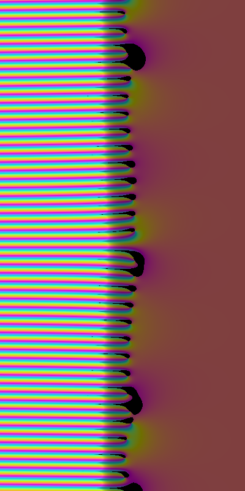

# zeta-riemann

This is an attempt at visualisation of [Riemann's zeta function](https://en.wikipedia.org/wiki/Riemann_zeta_function).

It relies on SDL2 for rendering.



## Quick start

```console

make
./zeta

```

After starting you have to wait few seconds for image because the algorithm is no very optimal.
